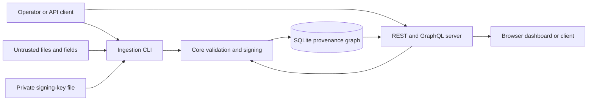

# Witness Threat Model

## 1. Overview

Witness is a local-first prototype that accepts provenance records through a CLI
and GraphQL mutation, stores them in SQLite, and exposes them through REST,
GraphQL, and a browser dashboard. It separates observed, inferred, and generated
records while preserving declared relationships and optional signatures.

| Component | Role and evidence |
| --- | --- |
| Ingestion CLI | Selects a database and optional key file; accepts observation, CSV, JSONL, inference, and generation input (`ingestion/src/main.rs:9-129`) |
| API | Serves read interfaces and an unauthenticated observation mutation; binds to loopback by default (`api/src/main.rs`) |
| Core ingestion | Builds records, validates imported CIDs and signatures, checks premises, and stores results (`core/src/ingestion.rs:16-206`) |
| Signing | Creates and validates Ed25519 signatures over implementation-specific serialized fields (`core/src/signing.rs:48-136`) |
| Storage | Writes nodes and edges transactionally and reads stored JSON (`core/src/storage.rs:15-188`) |
| SQLite schema | Constrains record types and stores nodes, narrative diffs, and graph edges (`core/migrations/001_initial_schema.sql:1-50`) |

The repository defines no supported production deployment. Any internet-facing
deployment is conditional and unsupported.

## 2. Threat model, trust boundaries, and assumptions

### Protected assets

- The distinction among observed, inferred, and generated records.
- Record bytes, identifiers, signatures, provenance edges, and visible history.
- Private signing keys and the accuracy of key-to-author claims.
- Availability and comprehensibility of evidence and verification failures.
- Sensitive or personal information that an operator may ingest despite the
  explicit prototype-stage prohibition on person-concerning records.
- Restriction metadata, confidential premise edges, identifying content
  digests, and generated or inferred copies that can perpetuate a sealed harm.
- Release code, dependencies, CI results, and maintainer authority.

### Actors and capabilities

- **Untrusted submitter:** controls imported files or API fields, but does not
  inherently control the host, database, signing key, or maintainer account.
- **Source publisher:** controls referenced source material and may revise,
  remove, selectively publish, or poison it.
- **Local operator:** controls process configuration, database location, and
  supplied key file. Current code does not isolate records from this actor.
- **Database attacker:** can alter the SQLite file outside the application. The
  current application detects some malformed data and some signed-record changes,
  but does not provide an external transparency log or immutable storage.
- **Consumer:** reads API or dashboard output and may overinterpret a valid
  signature or epistemic label.
- **Maintainer or dependency attacker:** may alter source, build inputs, releases,
  documentation, or repository settings if privileged accounts are compromised.

### Boundaries and objectives

| Boundary | Data crossing | Required property | Current control or unknown |
| --- | --- | --- | --- |
| File or API to ingestion | Arbitrary record fields and JSON | Reject invalid structure and category; bound resource use | Partial validation; no published size or rate limits |
| Key file to signer | Private Ed25519 key material | Confidentiality and explicit operator control | Local file read; no keystore, permissions, rotation, or revocation model |
| Core to SQLite | Nodes, JSON, edges, diffs | Atomic writes; no silent overwrite; valid relationships | Transactional node and edge insert; primary key; incomplete relationship enforcement |
| SQLite to readers | Stored untrusted strings and JSON | Explicit failure on malformed or unsupported data | Fallible decoding; no verification-on-read policy yet |
| API to browser/client | Records and rendered fields | No injection; retain category and trust limits | HTML escaping and browser security require dedicated review |
| External source to source URI | Mutable remote reference | Preserve retrieved bytes, digest, retrieval time, and source changes | URI only in current prototype |
| Repository to release | Source and dependencies | Reviewable, reproducible, attributable builds | CI checks source; no signed releases or reproducible-build claim |

Assumptions: the local host and operator are trusted for prototype use; SQLite
filesystem permissions are provided by the host; GitHub protects repository
access; and no real sensitive evidence is used. These assumptions must be
replaced with controls before public deployment.

## 3. Attack surface, mitigations, and attacker stories

These are threat hypotheses for design and testing, not validated vulnerabilities.

| Priority | Scenario and capability gain | Prerequisites | Impact | Existing controls | Required mitigation | Evidence |
| --- | --- | --- | --- | --- | --- | --- |
| Critical | Person-concerning bytes, premise edges, or identifying digests are published into an append-only graph without effective recall | Importer or operator accepts identifiable material | Durable exposure, deanonymization, targeting, or repeated false accusation across exports and mirrors | Prototype documentation now prohibits person-concerning ingest | Restriction/redaction/withdrawal/tombstone objects, CID policy, child propagation, export conformance, access control, affected-person appeal | `README.md`; privacy review response; issue #3 |
| Critical | Generated material is deliberately or accidentally labeled Observed at an ingest boundary | Submitter or operator controls classification input | Evidence-shaped synthetic language enters trusted downstream chains | Stored categories cannot be silently recast; documentation rejects relabeling | Profile validation, origin evidence, restricted ingest authority, challenge workflow, adversarial fixtures | `core/src/types.rs`; `core/src/ingestion.rs` |
| Critical | Stolen signing key lets an attacker create records that validate under that key | Read access to key file or operator environment | Durable impersonation and misleading provenance | Keys are loaded locally; signatures detect later byte changes | OS-backed key storage, least privilege, rotation, revocation, compromise records | `ingestion/src/main.rs:137-157`; `core/src/signing.rs:17-45` |
| High | Unauthenticated remote client submits fabricated observations | Operator overrides the loopback default and exposes the current GraphQL server | Database poisoning and misleading public output | Loopback bind by default; warning on non-loopback bind; input parsing and record typing | Authentication, authorization, quotas, review state, deployment-safe defaults | `api/src/main.rs` |
| High | Dashboard trust cues cause signature presence, CID match, category, or parent count to be read as identity, source custody, truth, or corroboration | Consumer relies on the interface instead of inspecting provenance limits | False authority survives screenshots and downstream summaries | Adjacent dashboard warnings; signature presence has no green badge; parent count disclaimer | Verification-on-read, identity/key lifecycle states, artifact and record digests, accessibility and adversarial UX tests | `dashboard/templates/index.html` |
| High | Database or application mutation removes or rewrites history | Host/database access or mutation flaw | Undetected evidence loss or altered narrative | Duplicate IDs fail; node and edge writes share a transaction | External append-only log, signed checkpoints, backups, fork detection, correction records | `core/src/storage.rs:15-67` |
| High | A valid signature is presented as proof of truth or identity | Misleading UI or downstream consumer | False authority and consequential decisions | Documentation states the boundary | Structured verification vector, identity attestations, UI tests, model-facing contract | `core/src/signing.rs:59-90`; `docs/VERIFICATION-MODEL.md` |
| High | Generated content is imported or relabeled as observed | Malicious submitter or weak importer | Synthetic material enters evidence chains as measurement | Type enum and schema check values | Evidence-profile validation, origin proofs, challenge and moderation workflow | `core/src/types.rs:6-17`; `core/migrations/001_initial_schema.sql:2-14` |
| Medium | Poisoned or later-edited source remains behind an unchanged URI | Source publisher controls external page | Provenance no longer points to reviewed bytes | Optional source URI | Preserve raw snapshots, response metadata, digest, license, and observed changes | `core/src/types.rs:41-65` |
| Medium | Oversized JSONL, CSV, query, or mutation exhausts resources | Local file access or exposed API | Service or ingestion denial of service | GraphQL read pagination is capped | File and field limits, streaming budgets, timeouts, rate limits | `core/src/ingestion.rs:87-146`; `api/src/main.rs:150-190` |
| Medium | Malformed database data crashes readers or is silently reclassified | Corrupted or externally modified SQLite | Availability loss or false observation | Fallible row decoding and schema checks | Verify on read, quarantine invalid rows, integrity audit command | `core/src/storage.rs:256-301`; `core/migrations/001_initial_schema.sql:2-14` |
| Medium | HTML or JSON content executes in a dashboard consumer | Attacker controls record text and consumer renders it unsafely | Browser compromise or data theft | Unknown pending focused rendering review | Contextual escaping, CSP, safe DOM APIs, adversarial UI tests | `dashboard/templates/index.html` |
| Medium | CI or dependency compromise changes released behavior | Dependency or privileged repository compromise | Backdoored verifier or signer | Lockfile and reviewable CI | Pin actions, dependency review, signed artifacts, reproducible build work | `Cargo.lock`; `.github/workflows/ci.yml` |
| Low | Many agreeing records create false appearance of independent support | Attacker can submit linked or copied records | Misleading corroboration | Parent IDs remain inspectable | Source-lineage analysis and independence warnings | `core/src/types.rs:41-65` |

## 4. Severity calibration

- **Critical:** compromise of broadly trusted signing keys or release authority
  that enables durable undetected forgery across deployed systems. Local-only
  key exposure in a developer fixture is lower severity.
- **High:** remote unauthenticated alteration, deletion, cross-boundary access,
  or systematic acceptance of invalid records in a reachable deployment. A path
  unavailable outside an operator-controlled local process is lower severity.
- **Medium:** realistic denial of service, stored browser injection, misleading
  verification, or corruption that becomes visible during independent checking
  and has a bounded recovery path.
- **Low:** limited robustness or maintenance defects without a meaningful new
  attacker capability, and documentation errors unlikely to change a security
  decision.

Severity depends on actual exposure, privileges gained, affected records,
detection, and recovery. Missing evidence is recorded as uncertainty rather than
used to inflate or dismiss impact.

Repository: github.com/seanebones-lang/witness
Version: 8b0b0389e079b1151391a4eee6b145756d3f15e0
